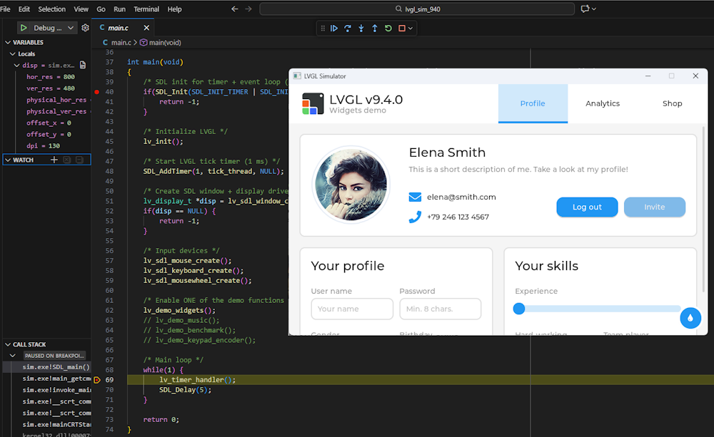
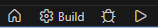
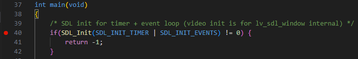

# 🧭 LVGL 9.4.0 Simulator for Windows

A clean, reproducible, debuggable LVGL 9.4.0 + SDL2 simulator on Windows.

[](https://github.com/Erriez/lvgl9-sdl2-windows-simulator/releases)
[](LICENSE)
[](https://github.com/Erriez/lvgl9-sdl2-windows-simulator/stargazers)
[]()
[]()
[]()
[]()
[]()

This project provides a clean and fully reproducible LVGL 9.4.0 simulator for Windows using
SDL2 (Simple DirectMedia Layer), Visual Studio 2022, and VS Code for debugging.

It showcases a minimal, well‑structured setup that supports LVGL’s latest demos, input drivers,
and layout systems, including grid, flex, and the new style pipeline.

The project is designed for maintainability, clarity, onboarding, and debugging. Every component
is explicitly configured: no legacy drivers, no broken CMake fragments, and no hidden dependencies.



> Running `lv_demo_widgets()` in a clean LVGL 9.4.0 + SDL2 Windows simulator, launched directly from 
  VS Code.

---

## ✅ Features

- LVGL v9.4.0 fixed release version built from source
  - Must be manually checkout out
  - ⚠️ Warning: This project is not compatible with older or newer LVGL versions
- SDL2 v2.32.10 (MSVC precompiled) linked manually
  - Must be manually downloaded and extracted
  - ⚠️ Warning: SDL3 is not compatible with LVGL 9!
- Tick timer via `SDL_AddTimer`
- Input drivers: `mouse`, `keyboard`, `mousewheel`
- Display driver: `lv_sdl_window_create()`
- Fully working `lv_demo_widgets()` and other demos with grid layout
- VSCode + CMake Tools integration
- F5-debuggable via `launch.json`
- LVGL examples:
  - Widgets demo
  - Music demo
  - Benchmark demo
  - Keypad/encoder demo
  - Mouse, keyboard, mousehweel input
  - 800x480 window (configurable)

This project is created entirely in my personal time using my own equipment. I am not employed by,
sponsored by, or affiliated with LVGL, SDL, CMake, Microsoft, or any other organization. All 
trademarks are the property of their respective owners.

---

## ❓ Why this project exists

This repository provides a clean, fully working LVGL 9.4.0 + SDL2 simulator for Windows, designed to
give developers a fast and reliable starting point for development and debugging. While other
simulators exist, many are outdated, incomplete, or poorly documented. This project offers a
reproducible, well‑structured, and fully documented alternative.

---

## 🔍 How this project differs from `lv_port_pc_vscode`

The official `lv_port_pc_vscode` repository is a large, multi‑platform reference port that
supports Windows, Linux, macOS, FreeRTOS, and multiple toolchains. It includes many optional
components, submodules, and abstractions intended for advanced or embedded use cases.

This project has a different goal: to provide a clean, minimal, and fully reproducible
LVGL 9.4.0 + SDL2 simulator for Windows using MSVC and VS Code. It contains no submodules,
no external dependencies (except LVGL and SDL2 sources), and no multi‑platform complexity. 
Everything required to build and run the simulator is included in the repository, making it a fast
and reliable starting point for development and debugging on Windows.

---

## 🧠 Prerequisites

The following tools are required:
- Windows (Tested on 11)
- [Visual Studio 2022 (Community)](https://visualstudio.microsoft.com/vs/community/)
- [Visual Code](https://code.visualstudio.com/)
  - Visual Code Extensions: 
    - C/C++ (Microsoft)
    - CMake Tools (Microsoft)
- [CMake](https://cmake.org/download/)
- [SDL2-devel-2.32.10-VC.zip](https://github.com/libsdl-org/SDL/releases/tag/release-2.32.10)

---

## ℹ️ SDL2 (Simple DirectMedia Layer)

SDL (Simple DirectMedia Layer) is a cross‑platform multimedia library that provides low‑level access 
to graphics, input devices, audio, timers, and window management. It acts as a thin abstraction 
layer over the operating system, making it easy to create windows, render graphics, and handle 
keyboard, mouse, and gamepad input in a portable way.

LVGL uses SDL2 on desktop systems to simulate embedded displays and input devices.

---

## ⚙️ Project Setup

The following directory structure will be created:

```
lvgl_sim_940/
├── .vscode/*.json          <-- VSCode configuration files
|
├── CMakeLists.txt          <-- Minimal simulator CMake build file for Windows
├── lv_conf.h               <-- Minimal LVGL configuration for simulator and demo's
├── main.c                  <-- Main application in C
|
├── build/                  <-- Build directory generated by CMakeFile.txt
│   └── Debug/x64/sim.exe   <-- Windows LVGL simulator executable
│   └── Debug/x64/SDL2.dll  <-- Copied by CMakeLists.txt from SDL2-devel-2.32.10-VC/SDL2-2.32.10/lib/x64/
|
├── lvgl/                   <-- Manually clone LVGL 9.4.0 source here
│   ├── src/
│   ├── demos/
│   ├── examples/
│   └── SDL2/               <-- SDL2 headers should be manually copied from SDL2-devel-2.32.10-VC/SDL2-2.32.10/include here
|
├── SDL2-devel-2.32.10-VC/  <-- Manually download SDL2 and extract here
│   └── SDL2-2.32.10/
│       ├── include/        <-- SDL2 include directory
│       └── lib/x64/
```

---

### 1. 📁 Create a clean project directory

```text
lvgl_sim_940\
```

---

### 2. 📥 Clone LVGL 9.4.0

```powershell
cd lvgl_sim_940
git clone --branch v9.4.0 https://github.com/lvgl/lvgl.git lvgl
```

---

### 3. 📥 Install SDL2 (Visual Studio version)

Download: [SDL2-devel-2.32.10-VC.zip](https://github.com/libsdl-org/SDL/releases/download/release-2.32.10/SDL2-devel-2.32.10-VC.zip)

Extract it into:

```
lvgl_sim_940\SDL2-devel-2.32.10-VC\SDL2-2.32.10\
```

Check that the following files exist:

```
include/SDL.h
lib/x64/SDL2.lib
lib/x64/SDL2main.lib
lib/x64/SDL2.dll
```

---

### 4. 📥 Copy SDL2 header files

Copy `lvgl_sim_940\SDL2-devel-2.32.10-VC\SDL2-2.32.10\include\*.h` to: `lvgl_sim_940\lvgl\SDL2\`

Note: Technical details explained later in this README why this step is required.

---

### 5. ⚙️ Configure CMakeLists.txt

```cmake
# Minimum CMake version required for this project
cmake_minimum_required(VERSION 3.10)

# Project name and language
project(lvgl_sim_940 C)

# Use C99 for the simulator
set(CMAKE_C_STANDARD 99)

# Add LVGL as a subdirectory so it builds as part of this project.
# LVGL generates its own Visual Studio project (lvgl.vcxproj).
add_subdirectory(lvgl)

# Path to the precompiled SDL2 development package (Visual Studio version)
set(SDL2_DIR "${CMAKE_SOURCE_DIR}/SDL2-devel-2.32.10-VC/SDL2-2.32.10")

# Make SDL2 headers available to *this* project (sim).
# Note: LVGL ignores external include paths and uses its own internal include tree.
include_directories(
    ${SDL2_DIR}/include
)

# Link directory for SDL2 libraries (SDL2.lib, SDL2main.lib)
link_directories(
    ${SDL2_DIR}/lib/x64
)

# Build the simulator executable
add_executable(sim
    main.c
)

# Link the simulator against LVGL and SDL2
target_link_libraries(sim
    lvgl
    SDL2
    SDL2main
)

# After building, copy SDL2.dll next to sim.exe so it can run without manual steps
add_custom_command(TARGET sim POST_BUILD
    COMMAND ${CMAKE_COMMAND} -E copy_if_different
        "${SDL2_DIR}/lib/x64/SDL2.dll"
        $<TARGET_FILE_DIR:sim>
)
```

---

### 6. 🧠 Configure lv_conf.h

🔍 `lv_conf.h` is based on LVGL 9.4.0 `lv_conf_template.h`. Below is a concise overview of the 
modifications required to turn the LVGL 9.4.0 template into a fully working Windows + SDL2 simulator
configuration.

Users can always inspect the full differences themselves by running:

```
diff lvgl/lv_conf_template.h lv_conf.h
```

or using any graphical diff tool.

---

#### ✅ Essential `lv_conf.h` configurations

**1. Enable LVGL’s built‑in memory allocator**
LVGL 9.x uses a new stdlib abstraction layer.  
You enabled the built‑in allocator and set a safe heap size:

```c
#define LV_USE_STDLIB_MALLOC LV_STDLIB_BUILTIN
#define LV_MEM_SIZE (256U * 1024U)
```

This prevents crashes in `lv_memset()` and ensures all demos run reliably.

**2. Enable SDL backend**
Required for the Windows simulator:

```c
#define LV_USE_SDL 1
```

LVGL’s SDL driver is compiled internally, so this must be enabled.

⚠️ SDL2 headers must be copied manually to `lvgl/SDL2/` so LVGL can resolve `#include "SDL2/SDL.h"`
during its own build.

**3. Enable the demo modules you want**
You activated the widgets demo (and optionally others):

```c
#define LV_USE_DEMO_WIDGETS 1
#define LV_USE_DEMO_MUSIC 1
#define LV_USE_DEMO_BENCHMARK 1
#define LV_USE_DEMO_KEYPAD_AND_ENCODER 1
```

These flags control which demo code LVGL compiles.

**4. Select fonts**
You enabled a few Montserrat fonts used by the demo's and set the default:

```c
#define LV_FONT_MONTSERRAT_14 1
#define LV_FONT_MONTSERRAT_20 1
#define LV_FONT_MONTSERRAT_24 1
#define LV_FONT_MONTSERRAT_26 1
#define LV_FONT_DEFAULT &lv_font_montserrat_14
```

**5. Logging configuration**
You enabled logging at WARN level:

```c
#define LV_USE_LOG 1
#define LV_LOG_LEVEL LV_LOG_LEVEL_WARN
```

**6. No legacy memory macros**
Older LVGL 8.x macros such as:

```
LV_USE_BUILTIN_MALLOC
LV_USE_BUILTIN_MEMCPY
LV_USE_BUILTIN_MEMSET
```

do **not** exist in LVGL 9.x and were omitted.

**7. What did *not* need to change?**

- No changes to rendering backends (DMA2D, PXP, G2D, VG‑Lite, etc.)  
- No changes to OS integration (`LV_USE_OS = LV_OS_NONE` is correct for SDL)  
- No changes to draw engines or GPU settings  
- No changes to bidi, Arabic, or advanced text features  
- No changes to object ID or property systems  

Your configuration is clean and minimal — exactly what a simulator needs.

### 7. 🧱 Create main.c

Essentials and minimal framework for a LVGL demo:

```c
#include "SDL.h"
#include "lvgl.h"
#include "lv_demos.h"

/* SDL timer callback: Called every 'interval' milliseconde */
static Uint32 tick_thread(Uint32 interval, void *param)
{
    LV_UNUSED(param);
    lv_tick_inc(interval);
    return interval;
}

int main(void)
{
    /* SDL init for timer + event loop (video init is for lv_sdl_window internal) */
    if(SDL_Init(SDL_INIT_TIMER | SDL_INIT_EVENTS) != 0) {
        return -1;
    }

    /* Initialize LVGL */
    lv_init();

    /* Start LVGL tick timer (1 ms) */
    SDL_AddTimer(1, tick_thread, NULL);

    /* Create SDL window + display driver (800x480) */
    lv_display_t *disp = lv_sdl_window_create(800, 480);
    if(disp == NULL) {
        return -1;
    }

    /* Input devices */
    lv_sdl_mouse_create();
    lv_sdl_keyboard_create();
    lv_sdl_mousewheel_create();

    /* Enable ONE of the demo functions below */
    lv_demo_widgets();
    // lv_demo_music();
    // lv_demo_benchmark();
    // lv_demo_keypad_encoder();

    /* Main loop */
    while(1) {
        lv_timer_handler();
        SDL_Delay(5);
    }

    return 0;
}
```

---

### 8. 🧪 Setup VSCode Debugging

Open `lvgl_sim_940` project directory with VSCode.

This automatically triggers CMake. The `Output` tab can show something like:

```
[proc] Executing command: "C:\Program Files\CMake\bin\cmake.EXE" --version
[proc] Executing command: "C:\Program Files\CMake\bin\cmake.EXE" -E capabilities
[kit] Successfully loaded 4 kits from C:\Users\<USER>\AppData\Local\CMakeTools\cmake-tools-kits.json
[variant] Loaded new set of variants
[proc] Executing command: chcp
[main] Configuring project: lvgl_sim_940 
[proc] Executing command: "C:\Program Files\CMake\bin\cmake.EXE" -DCMAKE_EXPORT_COMPILE_COMMANDS:BOOL=TRUE --no-warn-unused-cli -S lvgl_sim_940 -B lvgl_sim_940/build -G "Visual Studio 17 2022" -T host=x64 -A x64
[cmake] Not searching for unused variables given on the command line.
[cmake] -- Selecting Windows SDK version 10.0.26100.0 to target Windows 10.0.26200.
[cmake] -- The C compiler identification is MSVC 19.44.35222.0
[cmake] -- Detecting C compiler ABI info
[cmake] -- Detecting C compiler ABI info - done
[cmake] -- Check for working C compiler: C:/Program Files/Microsoft Visual Studio/2022/Community/VC/Tools/MSVC/14.44.35207/bin/Hostx64/x64/cl.exe - skipped
[cmake] -- Detecting C compile features
[cmake] -- Detecting C compile features - done
[cmake] -- The CXX compiler identification is MSVC 19.44.35222.0
[cmake] -- Detecting CXX compiler ABI info
[cmake] -- Detecting CXX compiler ABI info - done
[cmake] -- Check for working CXX compiler: C:/Program Files/Microsoft Visual Studio/2022/Community/VC/Tools/MSVC/14.44.35207/bin/Hostx64/x64/cl.exe - skipped
[cmake] -- Detecting CXX compile features
[cmake] -- Detecting CXX compile features - done
[cmake] -- 
[cmake] -- Using lv_conf.h from the top-level project directory
[cmake] -- Enabling the building of ThorVG internal
[cmake] -- Enabling the building of examples
[cmake] -- Enabling the building of demos
[cmake] -- Configuring done (3.4s)
[cmake] -- Generating done (0.1s)
[cmake] -- Build files have been written to: lvgl_sim_940/build
```

You should now see at the VSCode bottom left corner:

- **Build**
- **Debug**
- **Launch [sim]**



This means CMake Tools successfully configured the project.

Press `F5` to start debugging.


---

### 9. 🐞 Create a working `launch.json` (required for F5 debugging)

The following files are pre-configured and can be customized:
- `.vscode\launch.json`: This targets `build/Debug/sim.exe`
- `.vscode\settings.json`: Uses CMake Tools for IntelliSense
- `.vscode\tasks.json`: Builds via MSVC

VSCode does **not** generate a correct debug configuration for CMake projects.  
You must create it manually.

Create:

```
.vscode/launch.json
```

Content:

```json
{
    "version": "0.2.0",
    "configurations": [
        {
            "name": "Debug LVGL Simulator",
            "type": "cppvsdbg",
            "request": "launch",
            "program": "${workspaceFolder}/build/Debug/sim.exe",
            "args": [],
            "stopAtEntry": false,
            "cwd": "${workspaceFolder}",
            "environment": [],
            "console": "externalTerminal",
            "preLaunchTask": "CMake: build"
        }
    ]
}
```

This tells VSCode:

- Which executable to debug  
- Which debugger to use  
- Where the working directory is  
- To run a CMake build before debugging  

---

### 10. ▶️ Start debugging

1. Open `main.c`
2. Set a breakpoint in `main()`
3. Press **F5**
4. Choose **C++ (Windows)** if prompted (only the first time)



You should now see:

- The simulator window  
- The debugger stopping at your breakpoint  
- Press F5 to continue or F10/F11 to step throught the code
- Full MSVC debugging support  

---

## 👉 Troubleshooting

**Simulator window does not appear**

Check if `build\x64\Debug\SDL2.dll` exists. (It should be copied from `SDL2-2.32.10\lib\x64` by
`CMakeLists.txt`)

**Keypad not shown**

The keypad demo is hidden when mouse or keyboard input drivers are enabled.  
Disable the mouse and keyboard drivers in `main.c` to make the keypad visible.

---

## 🧩 Notes

- LVGL 9.4.x compiles its own SDL driver internally — do not use `lv_drivers`
- `lv_memset()` crashes occur if heap is misconfigured or tick timing is broken
- `lv_demo_widgets()` requires a working grid layout and style pipeline

### ❗ Why `LV_SDL_INCLUDE_PATH` and CMake include paths do not work in LVGL 9.x

LVGL 9.x builds its own SDL driver inside its own CMake target (`lvgl.vcxproj`).  
This target uses **private include paths** and Visual Studio’s `/external:I` mechanism, which 
**overrides and ignores** any include directories added from your top‑level CMakeLists.txt.

As a result:

- `target_include_directories()` has no effect on LVGL’s internal build  
- `${SDL2_DIR}/include` never appears in `lvgl.vcxproj`  
- `LV_SDL_INCLUDE_PATH` only works if the header is inside LVGL’s own source tree  
- relative or absolute paths cannot be resolved reliably  
- LVGL always compiles its SDL backend and always expects `#include <SDL2/SDL.h>` to resolve 
  *inside* the LVGL directory

Because of this design, **external SDL2 include paths are ignored**, and the only reliable solution
is:

### ✔ Copy the SDL2 headers into `lvgl/SDL2/`

This ensures that:

- LVGL’s internal build system can resolve `#include <SDL2/SDL.h>`  
- no Visual Studio or CMake overrides are required  
- the build is stable and reproducible across machines  
- LVGL’s SDL driver compiles correctly without patching LVGL itself

Until LVGL updates its CMake integration, this is the only portable and fully reproducible method.

---

## 🏁 Next Steps

- Add demo selector (widgets, benchmark, music)
- Add UI module structure for custom screens

---

## 🥇 Status

**Confirmed working on Windows:**
- LVGL 9.4.0
- SDL2 (SDL3 not working)
- MSVC 2022 with C++
- VSCode (with extensions C++/CMake Tools and configuraiton)
- Build and debugging
- CMake configuration
- Tick timer
- input + display driver
- Demo's: Widgets, Music, Benchmark and Keypad encoder

---

## 🎉 Result

You now have:

- A clean LVGL 9.4.0 simulator  
- Built with MSVC  
- Using SDL2  
- Managed by CMake  
- Fully debuggable with F5 in VSCode  

This setup is stable, reproducible, and ideal for UI development.
